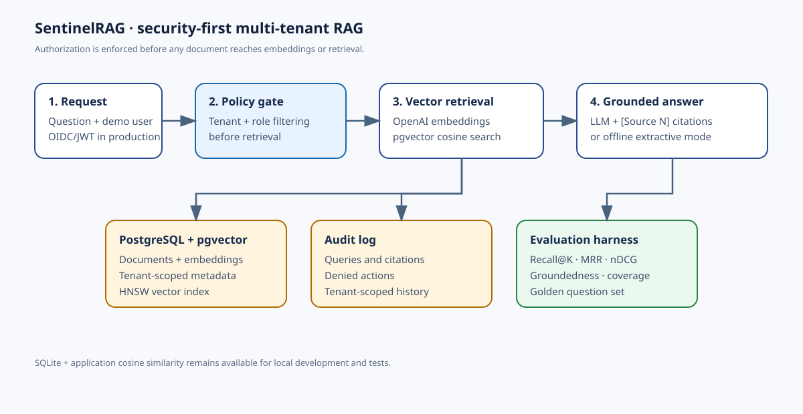

# SentinelRAG



SentinelRAG is a security-first, multi-tenant Retrieval-Augmented Generation service. It combines role-aware access control, semantic retrieval, grounded LLM answers, audit logging, evaluation metrics, and a PostgreSQL + pgvector deployment path.

## Resume value

- Enforced tenant and role authorization **before** vector retrieval
- Added OpenAI semantic embeddings with batched, cached calls
- Added grounded LLM generation with source citations and prompt-injection-resistant instructions
- Added PostgreSQL + pgvector storage with HNSW cosine search
- Added Recall@K, MRR@K, nDCG@K, groundedness, answer-term coverage, and access-control evaluation
- Added Docker Compose deployment with persistent PostgreSQL storage
- Added automated security regression tests for cross-tenant leakage

## Architecture

1. Authenticate the request and resolve its tenant and role.
2. Filter documents by tenant and role before embeddings or ranking.
3. Retrieve semantically relevant authorized content.
4. Generate a grounded answer with `[Source N]` citations.
5. Record the query, retrieved document IDs, and result count in an audit log.
6. Run the golden-set evaluation to measure retrieval quality and authorization safety.

The critical invariant is:

> Unauthorized documents never enter the retrieval candidate set.

The diagram is available as [`docs/architecture.svg`](docs/architecture.svg).

## Quick start: offline SQLite mode

This mode needs no API key or database server.

```bash
python3 -m venv .venv
source .venv/bin/activate       # Windows: .venv\\Scripts\\activate
pip install -r requirements.txt
uvicorn app.main:app --reload
```

Open http://127.0.0.1:8000. API documentation is at http://127.0.0.1:8000/docs.

The default providers are:

```text
Database: SQLite
Embeddings: deterministic local-hash fallback
Answers: extractive fallback
```

## Run the evaluation

```bash
make evaluate
```

The golden set contains answerable questions and an intentionally unauthorized question. It reports:

- Recall@K: whether a relevant document appeared in the top K
- MRR@K: how early the first relevant document appeared
- nDCG@K: ranking quality with position discounting
- Lexical groundedness: answer-token support in retrieved context
- Answer-term coverage: expected key-term coverage
- Access-control pass rate: unauthorized cases return no protected content

Latest offline baseline:

```text
3 answerable cases
Recall@3:                 1.0000
MRR@3:                    1.0000
nDCG@3:                   1.0000
Groundedness:             1.0000
Answer-term coverage:     1.0000
Access-control pass rate: 1.0000
```

The groundedness metric is a lightweight regression signal, not a proof of factuality. For production, add human-reviewed examples or an independent judge model.

## Enable real OpenAI embeddings and LLM answers

```bash
export OPENAI_API_KEY="your-key"
export EMBEDDING_PROVIDER=openai
export EMBEDDING_MODEL=text-embedding-3-small
export EMBEDDING_DIMENSIONS=1536
export LLM_PROVIDER=openai
export LLM_MODEL=gpt-4o-mini
uvicorn app.main:app --reload
```

Never commit the API key. The `/health` endpoint reports active provider names and models without exposing secrets.

## Run PostgreSQL + pgvector with Docker Compose

Copy `.env.example`, then configure the production values:

```bash
cp .env.example .env
# Set DB_BACKEND=postgres, DATABASE_URL, and your OpenAI settings in .env
docker compose up --build
```

The Compose stack contains:

- `app`: FastAPI service
- `db`: `pgvector/pgvector:pg16`
- Persistent `postgres_data` volume
- Database health-gated application startup
- PostgreSQL vector index using HNSW and cosine distance

For the offline Compose demo, use `EMBEDDING_PROVIDER=local-hash` and `EMBEDDING_DIMENSIONS=256`. For OpenAI embeddings, use `EMBEDDING_PROVIDER=openai` and `EMBEDDING_DIMENSIONS=1536`.

Useful commands:

```bash
make compose-up
make compose-down
```

## Demo users

| Header | Tenant | Role | Expected access |
|---|---|---|---|
| `X-Demo-User: alice` | acme | admin | all Acme documents |
| `X-Demo-User: bob` | acme | analyst | Acme analyst + shared documents |
| `X-Demo-User: cara` | acme | viewer | Acme viewer + shared documents |
| `X-Demo-User: diego` | globex | analyst | Globex documents only |

The header is intentionally a demo identity mechanism. Replace it with OIDC/JWT validation in production.

## API examples

```bash
curl -X POST http://127.0.0.1:8000/query \\
  -H 'Content-Type: application/json' \\
  -H 'X-Demo-User: bob' \\
  -d '{"question":"What does the Q4 roadmap prioritize?"}'

curl -X POST http://127.0.0.1:8000/documents \\
  -H 'Content-Type: application/json' \\
  -H 'X-Demo-User: alice' \\
  -d '{"title":"Security notice","content":"Acme rotates keys every 90 days.","allowed_roles":["analyst"]}'

curl http://127.0.0.1:8000/audit -H 'X-Demo-User: alice'
```

## Test

```bash
pytest -q
```

The test suite covers tenant isolation, role filtering, admin-only ingestion, audit logging, metric behavior, and local provider execution.

## Project layout

```text
app/
  db.py              # SQLite/PostgreSQL backend selector
  sqlite_db.py       # local persistence fallback
  postgres_db.py     # PostgreSQL + pgvector implementation
  embeddings.py      # OpenAI and offline embedding providers
  llm.py             # OpenAI and extractive answer generators
  rag.py             # ACL-first retrieval orchestration
  evaluation.py      # ranking and groundedness metrics
  main.py            # FastAPI endpoints
evaluation/
  golden_set.json    # evaluation questions and relevance labels
scripts/
  evaluate.py        # evaluation CLI
static/
  index.html         # browser demo
docs/
  architecture.svg   # architecture diagram
```

## Production hardening roadmap

1. Replace demo identity with OIDC/JWT and short-lived tokens.
2. Add document ingestion jobs with embedding-model versioning and reindexing.
3. Add reranking, rate limits, encrypted storage, and tenant-level quotas.
4. Add human-reviewed evaluation sets and citation faithfulness checks.
5. Add OpenTelemetry traces and dashboards for latency, token cost, retrieval quality, and denied-access attempts.

## Suggested resume bullet

> Built SentinelRAG, a multi-tenant permission-aware RAG service using OpenAI embeddings, grounded LLM generation, and PostgreSQL/pgvector; enforced ACL filtering before vector retrieval, added Recall/MRR/nDCG evaluation and audit logging, and deployed the stack with Docker Compose.
